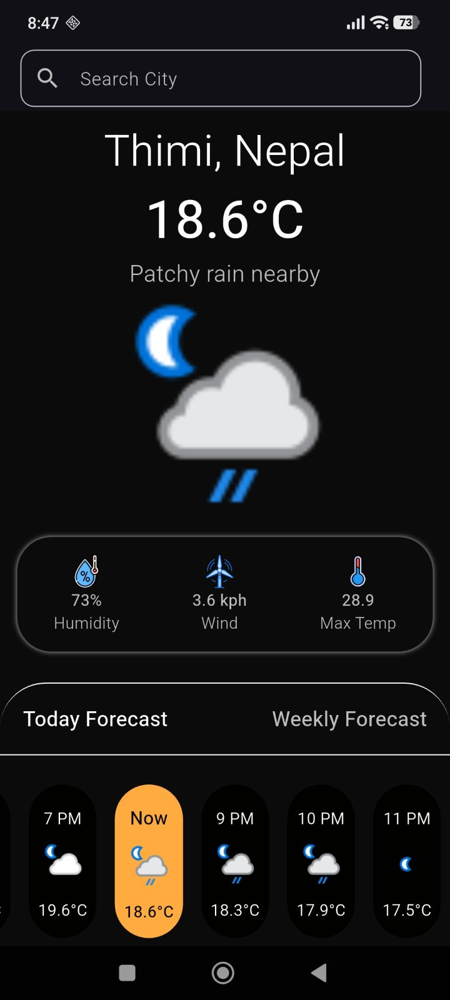
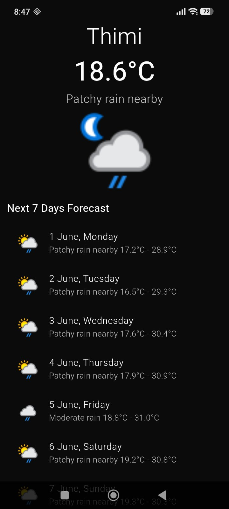

# 🌤️ Weather App

**A clean, cross-platform weather application built with Flutter & Dart**

[](https://flutter.dev)
[](https://dart.dev)
[](LICENSE)
[](https://flutter.dev/multi-platform)

---

## 📖 About

**Weather App** is a lightweight, cross-platform mobile and web application developed using Flutter and Dart. It fetches real-time weather data from the [WeatherAPI.com](https://www.weatherapi.com/) and presents it in a clean, user-friendly interface. The app is designed to work seamlessly across Android, iOS, Web, Windows, Linux, and macOS from a single codebase.

Whether you want to check the current temperature, see what conditions to expect throughout the day, or plan ahead with a forecast — this app delivers accurate, up-to-date weather information at a glance

---

## 🎬 Demo

> [demo.mp4](demo.mp4)

---

## 📸 Screenshots

|          Home Screen          |           Weather Details           | 
|:-----------------------------:|:-----------------------------------:|
|  |  |

---

## ✨ Features

- 🌡️ **Current Weather** — Displays real-time temperature, weather condition, and description for any city
- 📅 **Date & Time Display** — Shows the current date and time formatted using the `intl` package
- 🔎 **City Search** — Search weather by city name using a clean search interface
- 💧 **Humidity & Wind** — Detailed weather metrics including humidity percentage and wind speed
- ☁️ **Weather Conditions** — Handles various weather states: clear, cloudy, rainy, stormy, snowy, and more
- 📱 **Cross-Platform** — Runs natively on Android, iOS, Web, Windows, macOS, and Linux
- ⚡ **Lightweight** — Minimal dependencies; fast load times with simple HTTP networking
- 🎨 **Material Design** — Clean and intuitive UI using Flutter's Material Design components

---

## 🛠️ Tech Stack

| Category | Technology |
|---|---|
| **Framework** | [Flutter](https://flutter.dev/) 3.x |
| **Language** | [Dart](https://dart.dev/) ^3.9.2 |
| **Weather API** | [WeatherAPI.com](https://www.weatherapi.com/) |
| **HTTP Client** | [`http`](https://pub.dev/packages/http) ^1.6.0 |
| **Date & Formatting** | [`intl`](https://pub.dev/packages/intl) ^0.20.2 |
| **Icons** | [`cupertino_icons`](https://pub.dev/packages/cupertino_icons) ^1.0.8 |
| **UI** | Flutter Material Design |
| **State Management** | Flutter `StatefulWidget` |
| **Platforms** | Android, iOS, Web, Windows, macOS, Linux |

---

## 🌐 API Used

### [WeatherAPI.com](https://www.weatherapi.com/)

This app uses the **WeatherAPI.com Current Weather & Forecast API** to fetch real-time weather information.

- **Base URL:** `https://api.weatherapi.com/v1`
- **Authentication:** API Key (free tier available)
- **Response Format:** JSON
- **Free Tier Limit:** 1,000,000 calls/month
  **Endpoints used:**

| Endpoint | Description |
|---|---|
| `/current.json` | Real-time current weather for a location |
| `/forecast.json` | Weather forecast (up to 14 days) |

**Sample Request:**
```
GET https://api.weatherapi.com/v1/current.json?key={API_KEY}&q={city_name}&aqi=no
```

**Key data returned:**
- `current.temp_c` / `current.temp_f` — Current temperature (Celsius / Fahrenheit)
- `current.humidity` — Humidity percentage
- `current.condition.text` — Weather condition description
- `current.condition.icon` — Weather condition icon URL
- `current.wind_kph` — Wind speed in km/h
- `current.feelslike_c` — Feels-like temperature
- `forecast.forecastday[].astro.sunrise` / `.sunset` — Sunrise and sunset times
- `location.name` / `location.country` — Location details
> 🔑 Get your free API key at: [https://www.weatherapi.com/signup.aspx](https://www.weatherapi.com/signup.aspx)
 
---

## 🚀 Getting Started

### Prerequisites

Make sure you have the following installed:

- [Flutter SDK](https://docs.flutter.dev/get-started/install) (version 3.x or later)
- [Dart SDK](https://dart.dev/get-dart) (^3.9.2)
- An IDE: [VS Code](https://code.visualstudio.com/) or [Android Studio](https://developer.android.com/studio)
- A physical device or emulator (Android/iOS) or a browser (Web)

Verify your Flutter installation:
```bash
flutter doctor
```

---

### 📦 Installation

1. **Clone the repository**
   ```bash
   git clone https://github.com/saloneesthss/weather_app.git
   cd weather_app
   ```

2. **Install dependencies**
   ```bash
   flutter pub get
   ```

3. **Configure your API Key**

   Sign up at [OpenWeatherMap](https://openweathermap.org) and obtain a free API key. Then locate the file where the API key is defined (e.g., `lib/services/weather_service.dart` or `lib/constants.dart`) and replace the placeholder:
   ```dart
   const String apiKey = 'YOUR_API_KEY_HERE';
   ```

4. **Run the app**

    - **Android / iOS:**
      ```bash
      flutter run
      ```
    - **Web:**
      ```bash
      flutter run -d chrome
      ```
    - **Windows:**
      ```bash
      flutter run -d windows
      ```
    - **macOS:**
      ```bash
      flutter run -d macos
      ```
    - **Linux:**
      ```bash
      flutter run -d linux
      ```

---

## 📁 Project Structure

```
weather_app/
├── android/              # Android native project files
├── ios/                  # iOS native project files
├── web/                  # Web platform files
├── linux/                # Linux platform files
├── macos/                # macOS platform files
├── windows/              # Windows platform files
├── lib/                  # Main Dart source code
│   ├── main.dart         # App entry point
│   ├── services/         # API service layer (HTTP calls)
│   ├── screens/          # UI screens / pages
│   └── constants/        # Constant app themes and colors
├── test/                 # Unit and widget tests
├── pubspec.yaml          # Project dependencies and metadata
├── pubspec.lock          # Locked dependency versions
└── analysis_options.yaml # Dart linting rules
```

---

## 🔧 Dependencies

```yaml
dependencies:
  flutter:
    sdk: flutter
  cupertino_icons: ^1.0.8   # iOS-style icons
  http: ^1.6.0              # HTTP requests to weather API
  intl: ^0.20.2             # Date and number formatting

dev_dependencies:
  flutter_test:
    sdk: flutter
  flutter_lints: ^5.0.0     # Recommended lint rules
```

---

## 🤝 Contributing

Contributions are welcome! Here's how to get started:

1. Fork the repository
2. Create a new branch: `git checkout -b feature/your-feature-name`
3. Make your changes and commit: `git commit -m "Add your feature"`
4. Push to your fork: `git push origin feature/your-feature-name`
5. Open a Pull Request

Please make sure your code follows the existing style and passes all linting checks:
```bash
flutter analyze
flutter test
```

---

## 🐛 Known Issues / Roadmap

- [ ] Add GPS-based automatic location detection
- [ ] Implement a 5-day / 7-day weather forecast view
- [ ] Add hourly forecast breakdown
- [ ] Light mode support
- [ ] Add unit toggle (Celsius / Fahrenheit)
- [ ] Cache last fetched weather for offline access
- [ ] Add weather animations / Lottie icons

---
